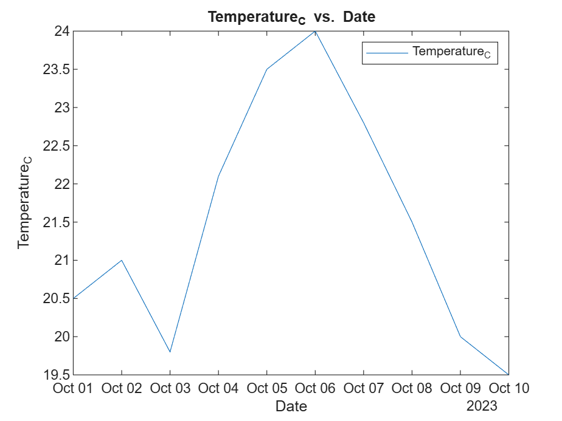
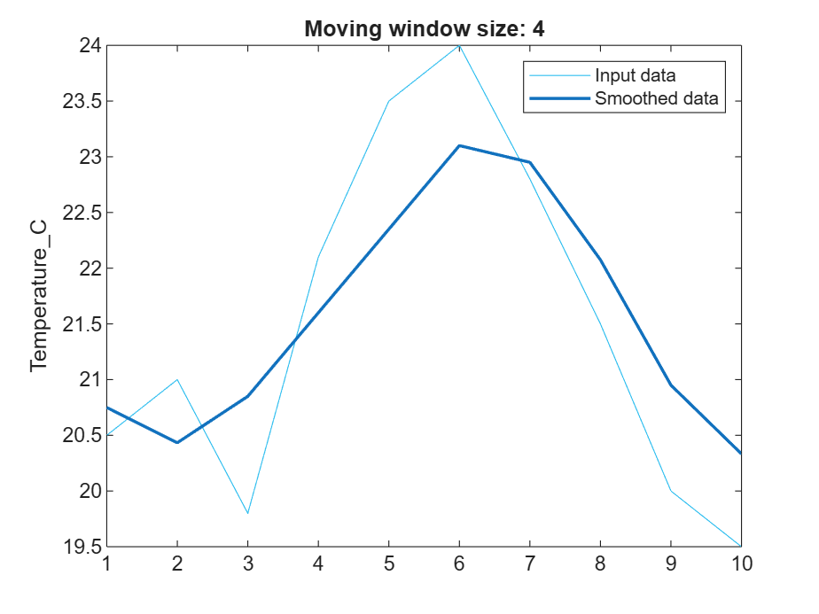

<a id="TMP_666a"></a>

# My super notebook  [](https://matlab.mathworks.com/open/github/v1?repo=yanndebray/AI-demos)
<!-- Begin Toc -->

## Table of Contents
&emsp;[Data generation](#TMP_321f)
 
<!-- End Toc -->
<a id="TMP_321f"></a>

# Data generation

prompt: generate a weather dataset and store in a table

```matlab
% Define the weather data
dates = datetime(2023,10,1) + days(0:9); % 10 days of data
temperatures = [20.5; 21.0; 19.8; 22.1; 23.5; 24.0; 22.8; 21.5; 20.0; 19.5]; % Temperatures in Celsius
precipitation = [0; 0; 5; 0; 0; 10; 0; 0; 0; 2]; % Precipitation in mm

% Create a table
weatherData = table(dates', temperatures, precipitation, ...
    'VariableNames', {'Date', 'Temperature_C', 'Precipitation_mm'})
```
| |Date|Temperature_C|Precipitation_mm|
|:--:|:--:|:--:|:--:|
|1|01-Oct-2023|20.5000|0|
|2|02-Oct-2023|21|0|
|3|03-Oct-2023|19.8000|5|
|4|04-Oct-2023|22.1000|0|
|5|05-Oct-2023|23.5000|0|
|6|06-Oct-2023|24|10|
|7|07-Oct-2023|22.8000|0|
|8|08-Oct-2023|21.5000|0|
|9|09-Oct-2023|20|0|
|10|10-Oct-2023|19.5000|2|

```matlab
% Create plot of selected data
h = plot(weatherData,"Date","Temperature_C","DisplayName","Temperature_C");

% Add xlabel, ylabel, title, and legend
xlabel("Date")
ylabel("Temperature_C")
title("Temperature_C vs. Date")
legend
```



```matlab
% Smooth input data
[newTable,winSize] = smoothdata(weatherData,"movmean",SmoothingFactor=0.25, ...
    DataVariables="Temperature_C");

% Display results
figure
plot(weatherData.Temperature_C,SeriesIndex=6,DisplayName="Input data")
hold on
plot(newTable.Temperature_C,SeriesIndex=1,LineWidth=1.5, ...
    DisplayName="Smoothed data")
hold off
title("Moving window size: " + string(winSize));
legend
ylabel("Temperature_C",Interpreter="none")
```



```matlab
clear winSize
```
